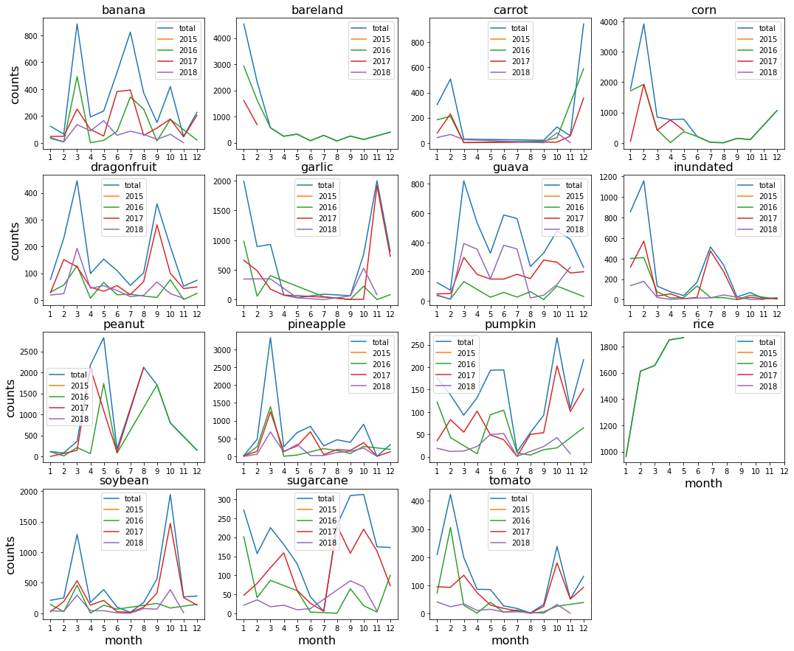
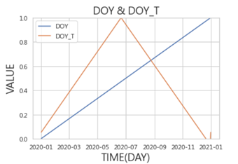

# Introduction

說明資料夾與程式檔案的用途

- `analysis` 存放資料分析的產出及程式檔案
- `data` 存放官方提供的資料及處理後的資料
- `logs` 存放模型訓練的紀錄檔案與文件
- `models` 存放訓練完畢的模型及權重檔案
- `outputs` 存放各個階段的類別機率輸出檔案
- `sample` 存放少量影像樣本
- `submission` 存放 Public 及 Private 階段的提交檔案
- `utils` 存放公用程式
- `efficientnet_classifier.ipynb` 多類別的深度學習模型程式，這次競賽的主要模型
- `efficientnet_gbm_classifier.ipynb` 多類別的深度學習模型 + GBM 程式，前期的實驗模型
- `xgb_ensemble_classifier.ipynb` 集成模型的程式

# Method

說明主要的方法與架構，更多實驗細節紀錄在 `logs` 資料夾的文件

## Data Pre-Processing

說明資料前處理的方法，程式實作參考 `efficientnet_classifier.ipynb` 檔案

- 從影像的 EXIF 提取拍攝時間及相機型號等屬性，更多細節參考[資料描述](./data#describe.csv)
- 將類別欄位轉換為 One-Hot Encoding 格式，供模型訓練使用
- 調整影像大小，縮放到相同的解析度（224x224）
- 模型架構帶有[正規化效果](https://www.tensorflow.org/api_docs/python/tf/keras/applications/efficientnet)，直接輸入值域為 0 到 255 之間的向量

## Data Split

說明不同階段的資料拆分策略，對於資料的更多細部資訊可以參考 `data` 資料夾的文件

- 在 Training 階段使用全部資料集的 20% 進行小規模快速實驗，資料總共 20,065 筆，預先以 70%、15%、15% 的比例切分為訓練（Training）、驗證（Validation）與測試（Testing）資料集
- 在 Public 階段使用全部資料進行完整實驗，資料總共 80,270 筆，預先以 85%、15% 的比例切分為訓練（Training）與驗證（Validation）資料集，並以 Validation 績效為內部比較基準
- 在 Public 階段的 Ensemble 實驗，將各個 Deep Learning 模型在驗證集（Validation）的輸出用於訓練 Ensemble 模型，並從其中拆分 20% 用於超參數優化

## Day of Year

根據 [Data Distribution by Month](./analysis#data-distribution-by-month) 的分析結果，發現作物在不同季節的生長狀況不同，例如：香蕉在 3、6、7 及 8 月數量最多，而花生在 4 及 5 月數量最多，故假設月份或年日等資訊對分類有幫助

基於前述假設，在部分實驗引入了一年中的第幾天（Day Of Year, DOY）變數之變體一年中的第幾天轉換型（Day Of Year Transform, DOYT），DOY 是將 1 月 1 日轉換成 1，將 1 月 2 日轉換成 2 的變數，能夠反應日期與日期間的鄰近關係

而 DOYT 是為了解決 DOY 無法反應 1 月 1 日與 12 月 31 日的鄰近關係，將夏至（6 月 22 日）及冬至（12 月 22 日）重設為變數最高與最低點的轉換版本，中間的天數則透過線性插值進行填值

下圖顯示 DOYT 與原本 DOY 差異，為了方便比較，數值被正規化至 0 與 1 的區間，可以發現原本 DOY 在 1 月 1 日與 12 月 31 日的數值差距最大，而轉換後 DOYT 的最高點重設為夏至、最低點重設為冬至，使得 1 月 1 日與 12 月 31 日的值接近

## Deep Learning Method: EfficientNet

模型使用 EfficientNet 在 Keras 上基於 ImageNet 之預訓練模型作為特徵擷取器，模型的 Dropout 比例為 20%，預訓練模型的權重僅作為模型初始權重，訓練過程中允許調整，並依序接上 1 層 GlobalAveragePooling2D、1 層 BatchNormalization、1 層比例為 20% 的 Dropout、1 層有 20 個節點的全連結層及 1 層有 14 個節點的全連接層作為分類層，模型架構如下所示：

訓練過程中，採用 Categorical Cross Entropy 作為 Loss Function；此外，若 Loss 在持續 10 個 Epoch 內沒有下降，就將 Learning Rate 設為當前的 0.31 倍，若 Loss 在持續 20 個 Epoch 內沒有下降，就停止訓練；訓練結束後，會將訓練階段在驗證集擁有最佳表現之 Epoch 的權重作為模型的最終權重，模型的其餘參數包括：

- Batch Size 設為 64
- 優化器使用 Adam
- 學習率設為 1e-04
- Epoch 設為 150
- Earlystop 機制設為 20 個 Epoch

## Ensemble Method: XGBoost

在這個比賽，我們分別使用了 3 種 Deep Learning 模型進行類別預測，我使用 [EfficientNet](https://www.tensorflow.org/api_docs/python/tf/keras/applications/efficientnet)、[@Tianming8585](https://github.com/Tianming8585) 使用 [ViT](https://github.com/google-research/vision_transformer)、[@Tsao666](https://github.com/Tsao666) 使用 [DCNN](https://arxiv.org/abs/2011.12960)，我們的模型各自有擅長與不擅長預測的類別，故使用 XGBoost（eXtreme Gradient Boosting）尋找模型間的最佳集成權重，集成模型的輸入參數是其他 Deep Learning 模型對 14 個類別的機率輸出

在訓練階段，使用其他 Deep Learning 模型對驗證資料集的輸出作為 XGBoost 的訓練資料；在提交階段，則使用其他 Deep Learning 模型對 Public 或 Private 資料集的輸出作為輸入參數

下表為我們所有模型在 Testing of Validation 資料集的績效比較表，可以發現 Ensemble Xgb 更進一步提升 Weighted Precision 分數

| method           | precision: valid (100%) | precision: test of valid (20%) |
| :--------------- | ----------------------: | -----------------------------: |
| Ensemble Xgb     |                         |                         0.9904 |
| EfficientNetB3   |                  0.9842 |                         0.9836 |
| EfficientNetB6   |                  0.9783 |                         0.9803 |
| ViT              |                  0.9806 |                         0.9784 |
| DCNN(w/o DOY)    |                  0.9757 |                         0.9742 |
| DCNN(DOY)        |                  0.9776 |                         0.9766 |
| DCNN(DOY, Sigmoid) |                  0.9750 |                         0.9773 |

# Conclusion

在這個比賽，最終取得了 Private 前 19% (30/151) 的成績，績效為 0.9876836

根據實驗結果，可以得到以下結論：

- 相較於串接其他分類器，直接使用 EfficientNet 進行分類的效果更好，績效差距達 7%
- 使用 Transfer Learning 的時候，允許調整預訓練模型的權重可以使模型更適應資料集，績效差距達 15%
- 由於作物的季節性，加入 Day Of Year 變數可以明顯提升績效，在 Transfer Learning、DCNN 及 Ensemble 的實驗皆得到驗證，績效差距介於 1%~5%
- 使用 20% 小量資料集進行快速實驗，與使用 100% 資料的績效差距為 3%，可以有效節省時間
