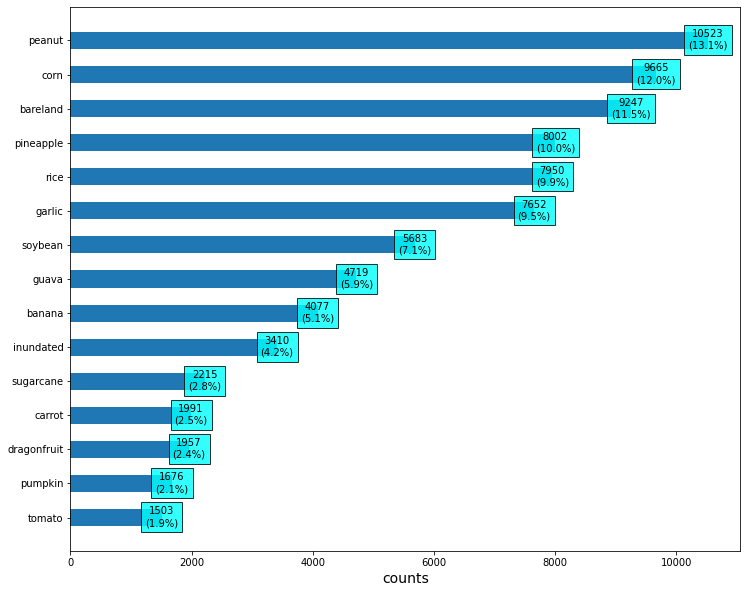
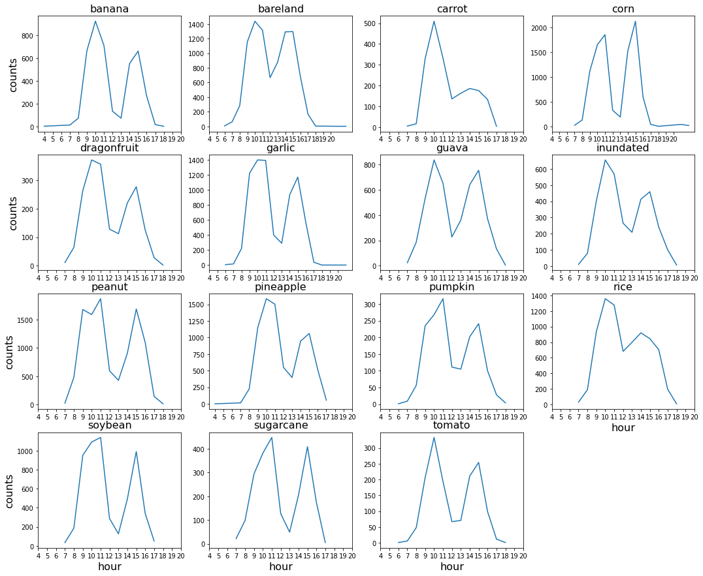
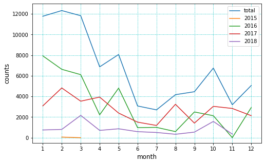

# Analysis

## Dataset Analysis

### Data Distribution

下圖為訓練資料集內，各類別的資料量及比例，可以發現前 10 種類別佔資料集的 88%，後 5 種類別的比例明顯較少

### Data Distribution by Hour

下圖為訓練資料集內，各類別資料在每天 24 小時的分佈，可以發現大部分的類別在 0~6 點的資料量較少，而 7~18 點的資料量較多，沒有類別差異

### Data Distribution by Month

下圖為訓練資料集內，將資料依年份、月份拆分後的分佈狀況，可以發現主要的拍攝年份為 2016 與 2017 年

下表為訓練資料集內，將資料依月份（不分年份）拆分後的統計資料，可以發現資料集中在 1~5 月，換言之，冬季和春季

| month | counts | percentage  |
|:-----:|-------:|------------:|
| 1     |  11773 |        15%  |
| 2     |  12323 |        15%  |
| 3     |  11824 |        15%  |
| 4     |   6868 |         9%  |
| 5     |   8064 |        10%  |
| 6     |   3078 |         4%  |
| 7     |   2701 |         3%  |
| 8     |   4171 |         5%  |
| 9     |   4458 |         6%  |
| 10    |   6752 |         8%  |
| 11    |   3197 |         4%  |
| 12    |   5061 |         6%  |

| season | counts | percentage  |
|--------|-------:|------------:|
| spring |  26756 |         33% |
| summer |   9950 |         12% |
| autumn |  14407 |         18% |
| winter |  29157 |         36% |

下圖為訓練資料集內，每種類別在不同年份、月份的分佈狀況

從年份的角度看，可以發現每種類別在 2016、2017、2018 的月份分佈趨勢接近（pumpkin 看起來較不一致，但它的總量很少），可以認為沒有必要對年份做處理

從月份的角度看，可以發現每種類別的月份分佈有差異，例如 banana 在 3、6、7、8 月最多，bareland 在 1 月最多，peanut 在 4、5 月最多，corn 在 2 月最多，或許可以導入月份相關的參數

