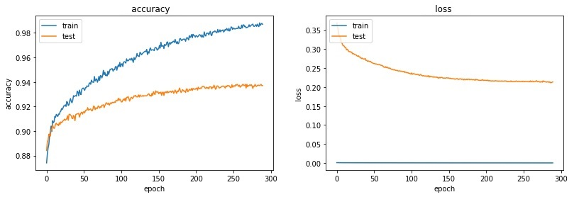
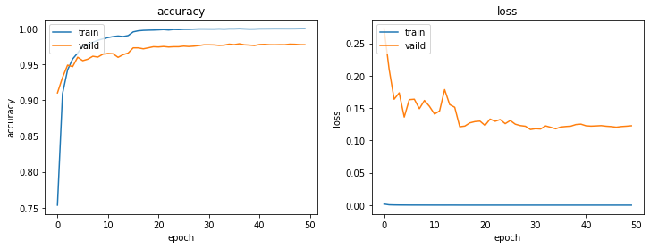

# Experiment: Training

紀錄並分析實驗的結果

在這個階段，使用全部資料集的 20% 進行小規模快速實驗，再以其中 15% 的測試（Testing）資料集績效作為方法好壞的評估基準，績效評量指標是 Weighted Precision

## SVM + VGG16

Dataset: [describe_train_subset.csv](../../data/describe_train_subset.csv)

Evaluation result

| method                | precision |   recall | f1-score | support |
| :-------------------- | --------: | -------: | -------: | ------: |
| VGG16-SVM-RBF         |  0.661568 | 0.644754 | 0.600152 |    3012 |
| VGG16-SVM-Linear      |  0.763416 | 0.764940 | 0.763328 |    3012 |
| VGG16-SVM-Linear-DOYT |  0.783485 | 0.785525 | 0.783518 |    3012 |

使用 Pre-training VGG16 當作特徵擷取器，輸入大小為 224x224 的影像，輸出維度為 4096 的向量，再使用 SVM 分類器來分類

VGG16 Pre-Training-Model: [vgg16_weights_tf_dim_ordering_tf_kernels.h5](https://github.com/fchollet/deep-learning-models/releases/download/v0.1/vgg16_weights_tf_dim_ordering_tf_kernels.h5)

## LightGBM + VGG19/EfficientNet

Dataset: [describe_train_subset.csv](../../data/describe_train_subset.csv)

Evaluation result

| method                         | precision |   recall | f1-score | support |
| ------------------------------ | --------: | -------: | -------: | ------: |
| VGG19-LightGBM                 |  0.713757 | 0.711915 | 0.701296 |    3013 |
| VGG19-LightGBM-DOYT            |  0.778135 | 0.777630 | 0.769516 |    3013 |
| VGG19-LightGBM-DOYT-HPO        |  0.804378 | 0.805178 | 0.801549 |    3013 |
| EfficientNet-LightGBM-DOYT-HPO |  0.879317 | 0.879522 | 0.877975 |    3013 |

使用 Pre-training VGG19 或 EfficientNet 當作特徵擷取器，輸入大小為 224x224 的影像，輸出維度為 4096（VGG19） 或 1280（EfficientNet） 的向量，再使用 LightGBM 的分類器來分類

對於標註 DOYT 的項目，是在輸入特徵向量時，加入 Day of Year 參數，讓模型學習作物的生長週期

對於標註 HPO 的項目，表示使用 Hyperopt 來尋找最佳的模型超參數，迭代 150 次

`VGG19-LightGBM-DOYT-HPO Parameters`

```json
{
  "class_weight": "balanced",
  "colsample_bytree": 0.5,
  "device": "gpu",
  "learning_rate": 0.01862365633270809,
  "max_depth": 2,
  "min_child_samples": 60,
  "min_child_weight": 9.0,
  "min_split_gain": 0.40948402791018407,
  "n_estimators": 100,
  "num_class": 14,
  "num_leaves": 36,
  "objective": "multiclass",
  "reg_alpha": 0.14006115707731265,
  "reg_lambda": 0.5961971734018511,
  "subsample": 0.5
}
```

`EfficientNet-LightGBM-DOYT-HPO Parameters`

```json
{
  "class_weight": "None",
  "colsample_bytree": 0.5,
  "learning_rate": 0.026622694688566075,
  "max_depth": 7,
  "min_child_samples": 30,
  "min_child_weight": 3.0,
  "min_split_gain": 8.221232425878033e-5,
  "n_estimators": 4900,
  "num_class": 14,
  "num_leaves": 29,
  "reg_alpha": 0.00013231176673023093,
  "reg_lambda": 0.04977589545584271,
  "subsample": 0.6000000000000001
}
```

## EfficientNet, Transfer Learning

| item | level | trainable | epochs | batch |  lr  | dropout | precision |
| ---- | ----- | --------- | :----: | ----- | :--: | :-----: | :-------: |
| [^1] | B0    | false     |  100   | 32    | 1e-4 |    0    | 0.774442  |
| [^2] | B0    | true      |  100   | 32    | 1e-4 |    0    | 0.927777  |

[^1]: efficientnetb0-transfer-epochs100-batchsize32-lr1e-4
[^2]: efficientnetb0-transfer-trainable-epochs100-batchsize32-lr1e-4

使用基於 imageNet 的 Pre-training EfficientNetB0 直接作為分類器，重新訓練模型的全連接層以將輸出調整為 14 種作物

在實驗 2 嘗試允許對 Pre-training EfficientNetB0 本身的權重進行調整，結果顯示允許調整權重的模型績效更好，模型更適應資料集

## Sample Weight and Dropout

| item | level | epochs | batch |  lr  | dropout | sample weight | precision |
| ---- | ----- | :----: | ----- | :--: | :-----: | ------------- | :-------: |
| [^2] | B0    |  100   | 32    | 1e-4 |    0    | false         | 0.927777  |
| [^3] | B0    |  300   | 32    | 1e-4 |   0.2   | true          | 0.933153  |

[^3]: efficientnetb0-transfer-trainable-epochs300-batchsize32-lr1e-4-dropout20-sampleweight

由於實驗 2 的模型有過擬合問題，故嘗試加入 Dropout 及 Sample Weight 等方法，結果模型績效提升約 0.5%



## XGBoost Ensemble x3

Dataset: [describe_train_subset.csv](../../data/describe_train_subset.csv)

使用 XGBoost 訓練 Ensemble 模型，尋找 Deep Learning 模型間的最佳集成權重，模型的輸入參數是其他 Deep Learning 模型對 14 個類別的機率輸出，XGBoost 的 輸入維度為 3 x 14，由 3 個模型對 14 種作物的估計機率組成

在這個實驗裡面，我們集成了 ViT、EfficientNet 及 DCNN 共 4 個 Deep Learning 模型的輸出，下表顯示 3 種模型與 Ensemble 模型在 subset 的績效，結果顯示 Ensemble 模型的績效確實最好

Evaluation Result (weighted avg of 3 models and ensemble)

|              | precision |   recall | f1-score | support |
| :----------- | --------: | -------: | -------: | ------: |
| EfficientNet |  0.933153 | 0.932293 | 0.932501 |    3013 |
| ViT          |  0.958108 | 0.957517 | 0.957506 |    3013 |
| DCNN         |  0.942650 | 0.941255 | 0.941624 |    3013 |
| Ensemble     |  0.969724 | 0.969134 | 0.969260 |    3013 |

Evaluation Result (ensemble)

|              | precision |   recall | f1-score |  support |
| :----------- | --------: | -------: | -------: | -------: |
| banana       |  0.967949 | 0.993421 | 0.980519 |      152 |
| bareland     |    0.9875 | 0.993711 | 0.990596 |      477 |
| carrot       |  0.955224 | 0.864865 | 0.907801 |       74 |
| corn         |  0.991501 | 0.964187 | 0.977654 |      363 |
| dragonfruit  |  0.986111 | 0.986111 | 0.986111 |       72 |
| garlic       |  0.982456 | 0.972222 | 0.977312 |      288 |
| guava        |  0.988827 | 0.983333 | 0.986072 |      180 |
| peanut       |   0.92176 | 0.959288 |  0.94015 |      393 |
| pineapple    |  0.996633 | 0.989967 | 0.993289 |      299 |
| pumpkin      |  0.967213 | 0.951613 |  0.95935 |       62 |
| rice         |  0.996575 |  0.97651 | 0.986441 |      298 |
| soybean      |  0.873874 | 0.902326 | 0.887872 |      215 |
| sugarcane    |   0.97619 |  0.97619 |  0.97619 |       84 |
| tomato       |  0.964286 | 0.964286 | 0.964286 |       56 |
| accuracy     |  0.969134 | 0.969134 | 0.969134 | 0.969134 |
| macro avg    |  0.968293 | 0.962716 |  0.96526 |     3013 |
| weighted avg |  0.969724 | 0.969134 |  0.96926 |     3013 |

[EfficientNet](</evaluation/EfficientNet/EfficientnetB0(TransferTrainable)-Epochs300-BatchSize32-LR1e-4-Dropout20-SampleWeight-224_predict.pkl>)  
[ViT](/evaluation/vision_transformer/ViT-default-20220422/predict_result.pkl)  
[DCNN](/evaluation/DCNN/DCNNDOY-3-conv12-he_uniform-adam-labelSmoothing-20220425-classWeight-subsetPredict.pkl)

## XGBoost Ensemble x3 + DOYT

Dataset: [describe_train_subset.csv](../../data/describe_train_subset.csv)

延續前個實驗，在 XGBoost 的輸入變數裡面再加入 Day of Year 參數，讓模型學習作物的生長週期，結果顯示 加入 Day of Year 參數的 Ensemble 模型的績效更好

備註：XGBoost 的 輸入維度為 3 x 14 + 1，由 3 個模型對 14 種作物的估計機率 + DOYT 組成

Evaluation Result (weighted avg of 3 models and ensemble)

|                | precision |   recall | f1-score | support |
| :------------- | --------: | -------: | -------: | ------: |
| EfficientNet   |  0.933153 | 0.932293 | 0.932501 |    3013 |
| ViT            |  0.958108 | 0.957517 | 0.957506 |    3013 |
| DCNN           |  0.942650 | 0.941255 | 0.941624 |    3013 |
| Ensemble       |  0.969724 | 0.969134 | 0.969260 |    3013 |
| Ensemble + DOY |  0.970744 | 0.970129 | 0.970272 |    3013 |

Evaluation Result (ensemble + DOYT)

|              | precision |   recall | f1-score |  support |
| :----------- | --------: | -------: | -------: | -------: |
| banana       |  0.967949 | 0.993421 | 0.980519 |      152 |
| bareland     |  0.989562 | 0.993711 | 0.991632 |      477 |
| carrot       |  0.970149 | 0.878378 | 0.921986 |       74 |
| corn         |  0.991477 | 0.961433 | 0.976224 |      363 |
| dragonfruit  |  0.986111 | 0.986111 | 0.986111 |       72 |
| garlic       |  0.979094 | 0.975694 | 0.977391 |      288 |
| guava        |  0.988889 | 0.988889 | 0.988889 |      180 |
| peanut       |  0.926108 | 0.956743 | 0.941176 |      393 |
| pineapple    |  0.996633 | 0.989967 | 0.993289 |      299 |
| pumpkin      |  0.967213 | 0.951613 |  0.95935 |       62 |
| rice         |  0.996575 |  0.97651 | 0.986441 |      298 |
| soybean      |     0.875 | 0.911628 | 0.892938 |      215 |
| sugarcane    |   0.97619 |  0.97619 |  0.97619 |       84 |
| tomato       |  0.964286 | 0.964286 | 0.964286 |       56 |
| accuracy     |  0.970129 | 0.970129 | 0.970129 | 0.970129 |
| macro avg    |   0.96966 | 0.964612 | 0.966887 |     3013 |
| weighted avg |  0.970744 | 0.970129 | 0.970272 |     3013 |

[EfficientNet](</evaluation/EfficientNet/EfficientnetB0(TransferTrainable)-Epochs300-BatchSize32-LR1e-4-Dropout20-SampleWeight-224_predict.pkl>)  
[ViT](/evaluation/vision_transformer/ViT-default-20220422/predict_result.pkl)  
[DCNN](/evaluation/DCNN/DCNNDOY-3-conv12-he_uniform-adam-labelSmoothing-20220425-classWeight-subsetPredict.pkl)

# Experiment: Public

紀錄並分析實驗的結果

在這個階段，使用全部資料進行完整實驗，再以其中 15% 的驗證（Validation）資料集績效作為方法好壞的評估基準，績效評量指標是 Weighted Precision

## EfficientNet

| item | level | epochs | batch |  lr  | dropout | sample weight | precision |
| ---- | ----- | :----: | ----- | :--: | :-----: | ------------- | :-------: |
| [^4] | B0    |  150   | 32    | 1e-4 |   0.2   | true          | 0.965507  |

[^4]: efficientnetb0-transfer-trainable-fullset1of3-epochs150-batchsize32-dropout20-sampleweight-224,efficientnetb0-transfer-trainable-fullset2of3-epochs150-batchsize32-dropout20-sampleweight-224,efficientnetb0-transfer-trainable-fullset3of3-epochs150-batchsize32-dropout20-sampleweight-224

首先重現在 Training 階段的最佳實驗結果，得到 96.55% 的 Weighted Precision，較 Training 階段的 93.31% 有顯著提升

由於完整資料集的資料量過大，當前 GPU 的記憶體無法負擔，所以將訓練資料集分成 3 等分，分別訓練 3 個模型，再將 3 個模型的輸出機率取平均，作為最終的預測結果，該 3 個模型的績效如下所示

| dataset | precision |
| :-----: | :-------: |
| 1 of 3  | 0.962100  |
| 2 of 3  | 0.961800  |
| 3 of 3  | 0.958000  |
|   Avg   | 0.965759  |

## LR Reducer

| item | level | epochs | batch |  lr  | dropout | sample weight | lr reduce | precision |
| ---- | ----- | :----: | ----- | :--: | :-----: | ------------- | --------- | :-------: |
| [^4] | B0    |  150   | 32    | 1e-4 |   0.2   | true          | false     | 0.965507  |
| [^5] | B0    |  150   | 32    | 1e-4 |   0.2   | true          | true      | 0.979078  |

[^5]: efficientnetb0-transfer-trainable-fullset{n}of3-epochs150-batchsize32-lrreducer-dropout20-sampleweight-224

根據過往研究，在訓練過程中逐漸降低學習率可以讓模型更容易收斂，所以在這邊加入 ReduceLROnPlateau 這個 Callback，結果績效提升 1.35%

由於硬體限制，同樣將訓練資料集分成 3 等分，分別訓練 3 個模型

| dataset | precision |
| :-----: | :-------: |
| 1 of 3  | 0.975500  |
| 2 of 3  | 0.973900  |
| 3 of 3  | 0.973300  |
|   Avg   | 0.979078  |

## EfficientnetB3~B6

| item | level | epochs | batch |  lr  | dropout | sample weight | lr reduce | precision |
| ---- | ----- | :----: | ----- | :--: | :-----: | ------------- | --------- | :-------: |
| [^5] | B0    |  150   | 32    | 1e-4 |   0.0   | true          | true      | 0.979078  |
| [^6] | B3    |  150   | 32    | 1e-4 |   0.0   | true          | true      | 0.984200  |
| [^7] | B6    |  150   | 64    | 1e-4 |   0.0   | true          | true      | 0.978200  |

[^6]: efficientnetb3-transfer-trainable-fullset{n}of3-epochs150-batchsize32-lrreducer-dropout20-sampleweight-224
[^7]: efficientnetb6-transfer-trainable-epochs150-batchsize64-lrreducer-dropout20-sampleweight-224

嘗試增加 EfficientNet 的模型深度，發現 B3 的效果最好

由於硬體限制，在訓練 B3 的時候同樣將訓練資料集分成 3 等分，但在訓練 B6 的時候由於是借用外部 GPU 資源，所以直接使用全部資料進行訓練



## XGBoost Ensemble x3 + DOYT (F)

Dataset: [describe_train_fullset_valid_test.csv](../../data/describe_train_fullset_valid_test.csv)

因應 Public 階段團隊成員使用 [describe_train_fullset.csv](../../data/describe_train_fullset.csv) 重新訓練模型，我也重新驗證 Ensemble 方法的有效性，並嘗試更多種組合，結果顯示 ViT + EfficientNetB6 + DCNN(DOY) + DCNN(DOY-SIG) 的 Ensemble 模型績效最好

由於 Ensemble 方法必須基於其他模型對 Validation 資料集的預測結果進行訓練，但 [describe_train_fullset.csv](../../data/describe_train_fullset.csv) 不再預設有 Testing 資料集，所以我額外從 Validation 資料集切出 20% 當作 Testing 資料集，並將剩下的 80% 當作 Ensemble 模型的 Training 資料集

Evaluation Result (weighted precision of each model)

| method           | precision: valid (100%) | precision: test of valid (20%) |
| :--------------- | ----------------------: | -----------------------------: |
| EfficientNetB3   |                  0.9842 |                         0.9836 |
| EfficientNetB6   |                  0.9783 |                         0.9803 |
| ViT              |                  0.9806 |                         0.9784 |
| DCNN(w/o DOY)    |                  0.9757 |                         0.9742 |
| DCNN(DOY)        |                  0.9776 |                         0.9766 |
| DCNN(DOYSigmoid) |                  0.9750 |                         0.9773 |

Evaluation Result (weighted precision of ensemble)

| combination                                | num of models | precision: test of valid (20%) |
| :----------------------------------------- | :-----------: | -----------------------------: |
| vit-eff6-dcnn(doy-sig)-dcnn(doy)           |       4       |                       0.990145 |
| vit-eff6-dcnn(doy-sig)-dcnn(doy)-dcnn      |       5       |                       0.990134 |
| vit-eff6-eff3-dcnn(doy-sig)-dcnn           |       5       |                       0.989775 |
| vit-eff3-dcnn(doy-sig)-dcnn(doy)           |       4       |                       0.989341 |
| vit-eff6-eff3-dcnn(doy-sig)-dcnn(doy)-dcnn |       6       |                       0.988956 |
| vit-eff6-eff3-dcnn(doy)-dcnn               |       5       |                       0.988881 |
| vit-eff6-eff3-dcnn(doy-sig)-dcnn(doy)      |       5       |                       0.988961 |
| vit-eff6-eff3-dcnn(doy)                    |       4       |                       0.988923 |
| vit-eff6-dcnn(doy)-dcnn                    |       4       |                       0.988497 |
| vit-eff6-eff3-dcnn(doy-sig)                |       4       |                       0.988490 |
| vit-eff3-dcnn(doy-sig)-dcnn(doy)-dcnn      |       5       |                       0.988439 |
| eff6-dcnn(doy-sig)-dcnn(doy)-dcnn          |       4       |                       0.988164 |
| eff6-eff3-dcnn(doy-sig)-dcnn(doy)          |       4       |                       0.986559 |
| vit-dcnn(doy-sig)-dcnn(doy)-dcnn           |       4       |                       0.986496 |
| eff6-eff3-dcnn(doy-sig)-dcnn(doy)-dcnn     |       5       |                       0.986033 |
| vit-eff6-dcnn(doy-sig)-dcnn                |       4       |                       0.986033 |

[EfficientNetB3](<https://github.com/Chang-Siang/farmland-crops/blob/main/src/evaluate/EfficientNet(fullset)/efficientnetb3(transfer,trainable)-epochs150-batchsize32-lrreducer-sampleweight-224.pkl>)  
[EfficientNetB6](<https://github.com/Chang-Siang/farmland-crops/blob/main/src/evaluate/EfficientNet(fullset)/efficientnetb6(transfer,trainable)-epochs150-batchsize64-lrreducer-sampleweight-224.pkl>)  
[ViT](https://github.com/Chang-Siang/farmland-crops/blob/main/src/evaluate/vision_transformer/ViT-default-20220509/predict_fullset.pkl)  
[DCNN(w/o DOY)](https://github.com/Chang-Siang/farmland-crops/blob/main/src/evaluate/DCNN/DCNN-conv14-he_uniform-adam-labelSmoothing-fullset-classWeight.pkl)  
[DCNN(DOY)](https://github.com/Chang-Siang/farmland-crops/blob/main/src/evaluate/DCNN/DCNNDOY-3-conv12-he_uniform-adam-labelSmoothing-fullset-classWeight.pkl)  
[DCNN(DOYSigmoid)](https://github.com/Chang-Siang/farmland-crops/blob/main/src/evaluate/DCNN/DCNNDOY-1-sigmoid-conv12-he_uniform-l2norm-adam-labelSmoothing-fullset-classWeight.pkl)
